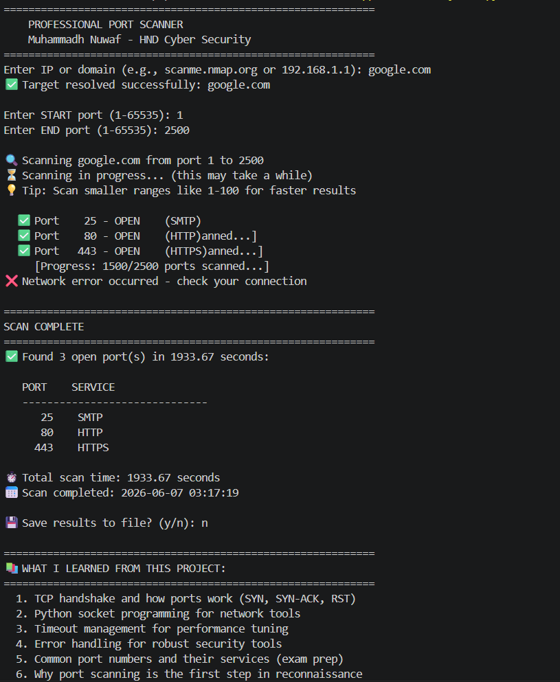

# 🔍 Python Port Scanner

Professional educational TCP Port Scanner built using Python socket programming.

---

## 📌 Overview

This project scans a target IP address or domain to identify open ports and common network services.

Port scanning is an important part of:
- Network reconnaissance
- Vulnerability assessment
- Security auditing
- Penetration testing

---

## ✨ Features

✅ Scan custom port ranges  
✅ Detect open TCP ports  
✅ Identify common services  
✅ Save scan reports to text files  
✅ Error handling and validation  
✅ Progress tracking  
✅ Educational cybersecurity notes  

---

## 🛠 Technologies Used

- Python 3
- Socket Programming
- TCP Networking
- Cybersecurity Fundamentals

---

## 🚀 How to Run

### Open Project Folder

```bash
cd python-port-scanner
```

### Run Scanner

```bash
python scanner.py
```

---

## 📷 Example Output


## 📚 What I Learned

- TCP/IP networking fundamentals
- Python socket programming
- Port scanning techniques
- Service identification
- Error handling
- Security tool development

---

## 🔐 Disclaimer

This tool is for educational purposes and authorised testing only.

Unauthorised scanning may violate computer misuse laws.

---

## 👨‍💻 Author

Muhammadh Nuwaf  
HND Cyber Security Student
